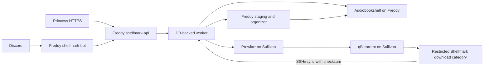

# Shelfmark upgrade plan

This document captures the review of the current Shelfmark repository and the proposed path to a Dockerized service on Freddy, integrated with Audiobookshelf, Prowlarr, qBittorrent, Sullivan, Discord, and an optional web UI.

The recommended deployment is:

- Shelfmark runs on Freddy beside Audiobookshelf.
- Freddy owns the canonical audiobook and ebook storage, job state, organizer, API, worker, and Discord bot.
- Sullivan remains the search and download host: Prowlarr → qBittorrent → a restricted Shelfmark download category.
- Freddy pulls completed downloads from Sullivan over restricted SSH/rsync, verifies them, organizes them, and triggers an Audiobookshelf scan.
- Discord handles requests and job control.
- A thin web UI handles metadata review, dense release selection, and large downloads.

At review time, no implementation changes had been made. The existing
self-test passed with Python 3.14.4. Docker Compose was not executed because
Docker is not installed in the review environment.

## Current progress

**Fixed 2026-09-21. A grab said "Queued release &lt;uuid&gt;" whether the book was downloading, already on the shelf, or refused outright.** Reported as "trying to download an ebook with discord but i don't think its working" — and nothing was broken. The release *"Frank Herbert - [Dune 01-06] (epub)"* is, by infohash, the same torrent as *"Dune Saga - Frank Herbert Collection"* already grabbed five days earlier; qBittorrent deduplicates on infohash, silently no-ops, and returns the same `Ok.` it returns for a real add. Every layer behaved correctly and the six Dune books were already in `/ebooks/Frank Herbert/`. The only defect was that nothing said so, which is indistinguishable from a broken pipeline.

`upstream` in the job result carried no signal at all — measured byte-identical (`{"added_torrent_ids": [], "failure_count": 0, "pending_count": 1, "success_count": 0}`) across grabs that downloaded and grabs that did nothing. `grab_release` now snapshots the category either side of the add and classifies the outcome: **added** (a new hash appeared), **duplicate**, **rejected**, or **bad_link** (an expired link returns an HTML page with HTTP 200). Telling duplicate from rejected requires the infohash, so `torrentmeta.py` computes it — only on the unusual path, so a normal grab pays nothing.

`_queue_grab` now waits for the job (about a second) instead of replying with a UUID, because the id comes back before any work happens. Four distinct sentences, with a test asserting they do not read alike.

Verified end to end: the new parser reproduces `b02e34adeb789a258f5807e28567feb60be0cf2b` for the real torrent, matching what qBittorrent independently reports.

**Changed 2026-09-21. The Discord command set is six commands, and every one of them is usable from Discord.** Four of the eight demanded an identifier the bot gave you no way to obtain, which is not a rough edge — it is the difference between a command existing and a command working.

| command | before | now |
|---|---|---|
| `/job` | required a job UUID that only ever appeared in an ephemeral reply | id optional; no id lists recent jobs |
| `/scan` | required the UUID of the **only** library, whose id the API already holds | no library argument at all |
| `/metadata-match` | required an Audiobookshelf item UUID nothing ever displays | **removed** — never run once in the life of the bot |
| `/organize-preview` | took a free-text absolute path into the worker's filesystem | **removed** — a debugging tool, better done on the host where there is a shell |

Both removals keep their API routes, so nothing is lost operationally. `POST /api/v1/libraries/scan` is new: it scans the configured library, declared above the `{library_id}` route because FastAPI matches in definition order and the path parameter would otherwise swallow the literal `scan`. The old by-id route stays.

`CommandRegistrationTests` now pins the exact command set and asserts no remaining id-shaped argument is required, so the defect cannot creep back a command at a time. The rate-limit partition test caught the new route on its first run — its hardcoded route count failed rather than letting an unlimited mutating route ship.

**Added 2026-09-21. `/cancel`.** The database, worker and API had supported cancellation all along (`cancel_requested`, `JobCancelled`, `POST /api/v1/jobs/{id}/cancel`); nothing exposed it, so a mis-pressed Grab had to be undone in qBittorrent by hand. `job_id` is optional — with none, `/cancel` lists what is queued or running with Cancel buttons, because the id only ever appears in an ephemeral reply that the person needing it has probably dismissed.

**It also caught the `_result_list` seam bug a second time.** `GET /api/v1/jobs` returns `{"jobs": [...]}` and `"jobs"` was not among the keys `_result_list` unwraps — the identical omission that made `/library type:audiobook` answer "nothing found" for every query for weeks. `/cancel` would have reported "nothing is queued or running" forever, with both halves looking correct in isolation. Found before shipping by testing across the seam rather than each side; `CancellableTests.test_the_bot_can_read_the_real_jobs_payload` now pins it.

**Added 2026-09-21. Searches are audited.** They were the one thing this system did that left no trace: the live `audit_events` table held 282 rows and every single one was a job (`job.queued` / `job.succeeded` / `job.failed`). So "has she actually been able to use the bot?" could only be answered if she had gone as far as grabbing something, and "how hard are we leaning on the indexer?" could not be answered at all — the rate limiter caps that usage without ever showing it. `Database.record_search` now writes `search.audiobook`, `search.ebook`, or `search.release.<scope>` with the query (truncated to 200 chars, not dropped) and the result count; zero-result searches are recorded too, since those are what "she couldn't find her book" looks like in the log. Recording is best-effort at the call sites — a search that succeeded must not become a 500 because a SQLite write failed.

These are the only `audit_events` rows with **no job behind them**, so `_delete_jobs_batch` (which prunes on `target_type='job'` joined to a job id) can never reach them. They get their own retention tier, `_sweep_searches`, at 90 days — without it this became the one table in the database that grows without bound.

**Fixed 2026-09-21. `/library type:audiobook` had never worked, for any query, since the day it shipped.** It answered *"No matching library items found."* against a library of 190 books. Nothing errored and nothing logged — the bug lived in the seam between two reasonable halves. `api.library_search` returned Audiobookshelf's own payload untouched, so the bot received `{"results": {"book": [...], "authors": [...], "series": [...]}}`, and `_result_list` looks for a **list** under `results` and then for a top-level `book` — it found neither and returned `[]`. The route now unwraps to a flat list of library items, which is the one shape a caller can rely on regardless of which Audiobookshelf endpoint it came from. `LibrarySearchShapeTests` asserts the route's shape *and* crosses the seam by feeding its output to the real `_result_list`, because asserting either side alone is exactly what missed this.

**Added 2026-09-21. `/library` can be browsed, not just searched.** `query` is now optional on both types — an empty query lists everything (`_BROWSE_LIMIT` 500, author order for audiobooks so Discord and the on-disk layout agree). It used to be required, which silently assumed the reader already knew what was on the server; the primary user of this command is exactly the person who does not. The empty-shelf and failed-search cases now say different things, so nobody hunts for a better search term that does not exist. Page size moved from a module constant to a **class attribute on the view**: `_PagedView` (the audiobook listing, no buttons at all) holds ten per page, while `ReleaseView`/`EbookView` override it back to five because each of their lines carries a button and Discord allows five components per row. Browsing 190 books is 19 presses of Next instead of 38 — and the page size is no longer something a calling command can get wrong. **Corrected the same day, after deploying:** the browse limit first shipped at 100 against a library of 190, so a browse showed a little over half the shelf and said nothing about the rest — the exact failure browsing exists to remove. Raised to 500, with both route ceilings raised past it (a route capped *below* the browse limit is a 422 that kills the command outright, not a quiet trim) and a test that reads each route's declared `le=` and asserts it clears `_BROWSE_LIMIT`, since the two numbers live in different files and had already drifted once.

**Added 2026-09-16.** A real `/request type:audiobook query:"the stand"` search returned five results whose Grab buttons sat right under wildly different sizes — the audiobook itself at 2813 MB, but also a "Westerns ... GraphicAudio Collection" at 26736 MB (26 GB) that outranked it, matching only because "Stand-Alone" contains "stand". One press of that Grab button queues the whole 26 GB collection with no second thought. This is **not** a disk-space guard (both storage hosts have hundreds of GB free) — the risk is a mis-click on a mis-ranked result, which then has to be found and undone in qBittorrent, on Sullivan's disk, and possibly in the library. `ReleaseView` in `discord_bot.py` now stops before queuing any release at or above `SHELFMARK_DISCORD_LARGE_RELEASE_THRESHOLD_MB` (default 5000 MB — comfortably above the longest single audiobook seen in practice, an order of magnitude below the 26 GB collection) and replies ephemerally with the title, its size, and a **Grab anyway** / **Cancel** pair; only pressing **Grab anyway** queues it. A release with no reported size is treated as needing confirmation too — the opposite of how `_too_large` treats a missing attachment size, because a grab has no second, real-bytes check downstream the way the ebook-attachment path does. The confirm button re-runs the role allow-list guard at press time, not just at the original `/request`, since the size-warning message can sit for up to 15 minutes. Below the threshold, one Grab press still queues immediately, unchanged. New pure function `_needs_confirmation` (tested in `tests/test_discord_bot.py::NeedsConfirmationTests`, mutation-tested); threshold lives in `Settings.discord_large_release_threshold_mb` (`tests/test_config.py::DiscordLargeReleaseThresholdTests`).

**Fixed 2026-09-16.** The first real multi-book collection this pipeline delivered — a six-book Frank Herbert Dune set — filed every book wrong. The source layout has the title+year in the per-book FOLDER and the author only in the sibling FILENAME (`Chapterhouse Dune (1985)/Chapterhouse Dune - Frank Herbert.epub`), and `parse_name` reads each of those two strings correctly on its own. The bug was in combining them: `enrich_meta`'s ebook/track heuristic assumes a filename dash-splits as `Author - Title`, so on a filename that dash-splits as `Title - Author` it guessed backwards whenever the title itself happened to read as a two-word person's name (`looks_like_person("Chapterhouse Dune")` and `("Dune Messiah")` are both true) — author became the TITLE and the real author was filed as the title (`Chapterhouse Dune/1985 - Frank Herbert`). Titles that didn't pass that check (`Dune`, `Children of Dune`) were merely left under `Unknown Author` instead — wrong a different way, but not a swap. Fixed with an explicit precedence rule in `enrich_meta`: when the folder gave no usable author (`Unknown Author` or an index), and the filename's leading dash-segment matches the folder-derived TITLE we already trust, the trailing segment is taken as the author and the title is left untouched — the filename is only ever consulted to fill a missing author, never to override a title or an author the folder already supplied. On a folder/filename title disagreement the folder's title always wins (unchanged from before this fix); only the author can come from the filename, and only when the folder had none. Regression coverage: `tests/test_organizer.py::MultiBookCollectionMetadataTests` (all six books) and a four-book fixture in `src/main.py`'s `--self-test`.

**Changed 2026-09-16.** The Discord bot had four search-ish commands
(`/library-search`, `/ebook-search`, `/ebook-request`, `/release-search`) split
by where the data lives, not by what a non-technical user wants — and
`/release-search`/`/ebook-request` had converged to the exact same call
(same endpoint, same `book_only=true`, same grab buttons), differing only in
embed title and an unused `limit`. Replaced with `/library` and `/request`,
each taking a `type:<audiobook|ebook>` choice rendered by Discord as a picker
(`app_commands.Choice`, not free text). The four old commands were retired
outright, not aliased — two users of this bot, and guild-scoped sync is
instant, so a transition period buys nothing a Discord message doesn't.
Also fixed a real gap this surfaced: audiobooks were unfindable through
Prowlarr search at all, since `book_only`'s only category bucket
(`PROWLARR_BOOK_CATEGORIES`, default 7000) returns zero audiobooks — verified
against the live indexer across 103 results. `/api/v1/releases/search` gained
`media_type` (`ebook`/`audiobook`), which applies the new
`PROWLARR_AUDIOBOOK_CATEGORIES` setting (default `3030,100064`) and takes
precedence over `book_only` when set; `book_only` itself is unchanged and
still the default for any caller that doesn't specify a type.

**Fixed 2026-09-14.** A real download filed as `Unknown Author/tr8e3el/tr8e3el.epub` instead of `Brenda Peynado/2021 - The Rock Eaters/…` — and this hits every scene release, not an edge case. A scene release always ships as a well-named release folder holding an obfuscated archive (`Brenda.Peynado.-.The.Rock.Eaters.2021.RETAIL.EPUB.eBook-CTO/tr8e3el.rar`); `extract_dir_for` names the extracted directory after the ARCHIVE (`tr8e3el.rar` → `tr8e3el/`), and the post-extraction re-scan read metadata from that meaningless name instead of the release folder one level up, which is the only place the author/title/year actually live. `normalize_meta` now climbs out of a book folder whose own name `parse_name` reads as nothing at all (no author, no year — the case a legitimately-named folder like `Author - Title (2001)` never hits), the same idea as the existing disc/section climb, stopping at the first ancestor that actually parses. Also: `strip_quality` only stripped audio format tags (mp3/m4b/…), so an ebook release's own format name survived into the title (`"The Rock Eaters EPUB"`); it now also strips epub/mobi/azw3/pdf. Regression test: `tests/test_organizer.py::SceneReleaseMetadataTests`.

**Fixed 2026-09-14.** PR #17's `reconcile_downloads` only ever watches qBittorrent's `shelfmark-books` category, but `grab_release` still called `ProwlarrClient.grab()`, which POSTs to Prowlarr's OWN `/api/v1/search` and hands the release to whatever download client Prowlarr itself has configured — on the live system, one client fixed to category `prowlarr`. Every grabbed release landed in a category the reconciler never watches and sat there forever, making the whole automated pipeline inert. `grab_release` now adds the release to qBittorrent directly with `QBittorrentClient.add_urls()`, reading the SAME `QBITTORRENT_CATEGORY` setting the reconciler does so the two can never drift apart again. See the "Automatic download pipeline" section in README.md and `QBITTORRENT_PROWLARR_BASE_URL` in `.env.example` for the URL-rewrite this required.

**Deployed 2026-09-12.** Shelfmark runs on Freddy beside Audiobookshelf:
`shelfmark-api` and `shelfmark-worker` from `ghcr.io/nuniesmith/shelfmark:latest`,
published at `shelfmark.7gram.xyz` through Princess. The Discord bot sits behind a
`discord` Compose profile until a token exists. P0 is largely closed — see
[`docs/INVENTORY.md`](INVENTORY.md) for the configuration record and findings.

The first implementation slices are complete: organizer safety fixes, regression
coverage, Python packaging metadata, a reproducible CLI container, the initial
API/SQLite worker foundation, and isolated transport clients for the three
existing media APIs have been added. No live Freddy or Sullivan deployment has
been changed yet.

Validation run locally with Python 3.14.4:

```text
python3 -m unittest discover -s tests -v   # 10 tests passed
python3 src/main.py --self-test             # self-test OK
```

The remaining service work still needs the API, persistent jobs, integration
clients, Discord adapter, and staged deployment checks described below.

## Current repository

The current project is a command-line organizer and Audiobookshelf metadata repair utility.

Implemented capabilities include:

- Audiobook and ebook detection.
- Archive extraction.
- Author, title, year, and narrator parsing.
- Audio tag enrichment through Mutagen.
- Cover and sidecar handling.
- Dry-run previews.
- Move or copy workflows.
- Audiobookshelf metadata repair.

Relevant files:

- `src/main.py` — organizer, parser, archive handling, plan generation, and CLI.
- `src/fix_metadata.py` — one-off Audiobookshelf metadata repair utility.
- `run.sh` — local virtualenv bootstrap and CLI entrypoint.
- `requirements.txt` — currently only `rarfile` and `mutagen`.
- `README.md` — current CLI behavior and expected library layout.

There is currently no Dockerfile, HTTP API, persistent job database, background worker, Discord bot, Prowlarr integration, qBittorrent integration, Sullivan-to-Freddy transfer mechanism, web UI, or CI test suite.

## Pre-automation defects to fix

These should be fixed before allowing an unattended service to move or delete files.

- [ ] Fix book identity in `src/main.py`. The current merge key (`merge_duplicate_books`, for combining disc1/disc2 of one book within a single scan) already includes media type and narrator; still missing series, series position, edition, language, format, and checksum where available.
- [ ] Keep audiobooks and ebooks in separate plans even when their normalized author/title/year values match.
- [ ] Prevent different narrators and editions from merging into one book.
- [x] Detect when an INCOMING book's destination already holds a DIFFERENT book under the same name, and refuse to merge into it. A test book named "Mary Shelley - Frankenstein (1818)" organised into a library that already held "Mary Shelley/1818 - Frankenstein/" with tracks 01.mp3-09.mp3: both parsed to the same dest_dir and the same track numbering, so the organiser wrote straight into the existing folder, and `unique_file` only masked the result — the new tracks landed as `01 (2).mp3` beside the originals with nothing reported. `colliding_tracks` now compares each incoming track/ebook against whatever already sits at its destination name; anything `files_identical` says no to moves the WHOLE incoming book to quarantine instead of merging (`plan.collisions`, reported in `plan.warnings`), and the existing book is never opened, read, or written. Detection is by matching FILE NAME, not by "same edition as a whole" — it only fires when an incoming name collides with one already at dest_dir. **Caveat, by design:** only `tracks` are compared — a differing cover or `metadata.json` alone does not block a merge, since covers legitimately differ between two honest deliveries of the same book. **Caveat, measured, broader than expected:** without `--keep-names` (the default, and what the automatic/service pipeline always uses), tracks renumber from `01` within the incoming set regardless of how many exist at the destination already, so even a very different track count still collides — that is NOT a gap. But it also means delivering a single genuinely-missing track by itself (e.g. a lone `03.mp3` for a 2-track book) renumbers to `01.mp3` and quarantines the whole one-file delivery against the existing track 1 — fails safe (nothing lost, path named in the warning) but is manual work for an ordinary "here's what was missing" delivery. Workaround: re-deliver the whole book (all existing tracks, bit-identical, plus the new one) in one folder — it merges cleanly with no collision. **Caveat, the real gap:** `--keep-names` preserves the source's own file names instead of renumbering, so a genuinely different copy of the same book with different upstream names can produce disjoint file names that never collide, and both copies silently interleave into one folder with no warning at all. Does not affect the automatic/unattended pipeline (never passes `--keep-names`); regression test `test_KNOWN_GAP_keep_names_lets_a_different_copy_merge_silently` in `tests/test_organizer.py` pins this as accepted-for-now, not fixed.
- [ ] Preserve `metadata.json`, OPF files, manifests, embedded metadata, and recognized sidecars when scanning an already-managed library.
- [ ] Make unknown-file trashing explicit and disabled by default for managed libraries.
- [ ] Include parent-directory context in multipart archive identity so unrelated folders cannot be conflated.
- [x] Extract archives into an isolated staging directory before importing their contents. Staged beside the destination so the finished tree moves into place with an atomic `rename` — a staging root on another filesystem would make that a copy, with an observable half-done state.
- [x] Leave failed archives in place and mark the job failed; never move a failed archive to trash and return success. The archive is trashed only after a successful extract.
- [x] Make move/copy operations resumable and idempotent. If the destination already contains the same file, compare size/checksum and skip it instead of creating `01 (2).mp3`. The remaining hole was an INTERRUPTED write: a truncated file under the real name is not identical to the source, so the retry wrote `01 (2).mp3` beside it. Writes now stage and rename, so the destination is complete or absent.
- [x] Add an append-only transaction manifest for every worker import: source, destination, operation, checksum, timestamp, actor, and result.
- [x] Write destination files atomically, then rename the completed destination directory into place. **Files are atomic** — staged in the destination directory, fsynced, renamed into place; `move` uses `os.rename` directly within a filesystem and stages only across the EXDEV boundary. **Whole-directory staging is done for new books**: a book whose destination folder does not exist yet is assembled in `.shelfmark-work-books` beside it (a separate marker from archive extraction's `.shelfmark-work`, so the two can never contend over one working directory) and handed over with a single `rename`, so the library never shows one missing tracks. A same-filesystem track is staged with `os.rename` too, not a copy — reorganising a library in place stays metadata-only work, not a full read-and-rewrite — with each renamed pair recorded so a failure partway can reverse them; a rename-back that itself fails leaves the staging directory in place (printed for recovery) rather than deleting the only remaining copy. Filing into a book already on disk (a repeat run, or new files for one already imported) still writes file by file — that folder is already visible to a scan either way, and `rename` cannot merge into a non-empty destination regardless. **Caveat:** the rollback above only runs for catchable failures. `SIGKILL`/OOM/power-cut skip it entirely, stranding renamed tracks in `.shelfmark-work-books` — invisible to a scan and no longer in the source, which is a regression against the old file-by-file behaviour's self-healing re-run. Every run now checks the destination tree for one of these before scanning and reports it loudly on stderr; it is never deleted or auto-completed, so recovery is manual. Full resume/auto-recovery is a separate, still-open item.
- [ ] Use a quarantine directory for failed or ambiguous jobs instead of deleting source material. **Done for extraction failures** and **done for a book collision during organize** (an incoming book whose dest_dir already holds a different book — see the identity item above), both under `--quarantine`, default `<source>/.shelfmark-quarantine`; still open for other job types.
- [x] Review all archive extractors for path traversal and symlink behavior. External extractors should run in staging with post-extraction validation. `_safe_target` screens member names; `_reject_escaping_links` runs after extraction, which is the only point unrar/unar/7z can be held to the same rule.
- [ ] Keep the CLI dry-run/apply behavior compatible with the existing README.
- [ ] Treat `fix_metadata.py` as a migration utility, not as the live metadata path. Revisit its assumption that metadata always exists at exactly two directory levels.
- [ ] Align the Python version requirement. Use Python 3.13 or newer in Docker and update the README and `run.sh` check accordingly.

## Compose and storage findings

### Freddy

The checked-in Freddy compose already provides the audiobook root:

- Host `/mnt/1tb/audiobooks` is mounted as `/audiobooks` for Audiobookshelf in `freddy.docker-compose.yml`.
- Audiobookshelf publishes host port `13378` to container port `80`.
- Freddy has no Shelfmark service yet.
- Nextcloud already uses host port `8080`, so Shelfmark should use a different port such as `8110`.
- Freddy and Sullivan are separate Docker hosts; container names from Sullivan will not resolve from Freddy.

Suggested Freddy paths:

```text
/mnt/1tb/audiobooks              existing audiobook root
/mnt/1tb/ebooks                  canonical ebook root
/mnt/1tb/shelfmark/incoming      transferred downloads
/mnt/1tb/shelfmark/work          extraction and temporary work
/mnt/1tb/shelfmark/quarantine    failed or awaiting-review jobs
/mnt/1tb/shelfmark/data          database and application state
/mnt/1tb/shelfmark/backups       manifests and database backups
```

### Sullivan

The Sullivan compose contains the services needed for the download side:

- qBittorrent is on the `download` network and publishes port `8080`.
- Prowlarr is on the `download` network and publishes port `9696`.
- qBittorrent exposes `/complete`, `/audiobooks`, and `/ebooks` using Sullivan host paths.
- Unpackerr watches the whole `/complete` tree.
- There is no Readarr or audiobook-specific *arr service in the checked-in compose.
- Calibre and Calibre-Web currently use Sullivan book storage rather than Freddy storage.

Important path issue:

- qBittorrent defaults to `/media/qbittorrent/complete`.
- Sonarr, Radarr, Lidarr, Filebot, and Unpackerr default to `/mnt/media/qbittorrent/complete`.

The real `.env` may override these values, so resolve both deployments with `docker compose config` and normalize them before integration.

Unpackerr and Shelfmark must not process the same directory concurrently. The recommended choice is to reserve `/complete/shelfmark-books` for Shelfmark and let Shelfmark's existing Python organizer own extraction for that category. Exclude it from Unpackerr's general folder watcher.

Calibre-Web's current application-data mapping is `/data`, while LinuxServer's documentation specifies `/config`. Correct this before relying on Calibre-Web. Also decide which system owns the ebook database; do not let Calibre-Web and Shelfmark write the same Calibre database concurrently.

The Sullivan compose contains a literal Plex claim credential. Rotate it and remove it from the compose and Git history. Store all API keys, passwords, bot tokens, OIDC secrets, and SSH keys outside Git.

## Target architecture



Run three processes from one Shelfmark image:

- `shelfmark-api` — FastAPI REST API, health endpoints, and web UI backend.
- `shelfmark-worker` — one persistent worker for transfers, extraction, organization, metadata, and scans.
- `shelfmark-bot` — Discord Gateway client.

For the first release, SQLite in WAL mode is sufficient with one worker. Store it under `/mnt/1tb/shelfmark/data`. Keep the data layer abstract so PostgreSQL can be added later if multiple workers or higher concurrency become necessary.

The worker must never accept arbitrary filesystem paths from Discord or the web UI. It should only resolve known library roots and job-managed staging directories.

## Data model and job state

Add durable records for:

- `library_items` — normalized author, title, year, series, narrator, format, path, checksum, size, Audiobookshelf ID, and ebook authority ID.
- `search_results` — normalized Prowlarr result, release GUID, indexer, format, size, seeders, score, and expiry time.
- `download_jobs` — request UUID, actor, guild/channel/message IDs, release ID, Prowlarr ID, qBittorrent hash, and status.
- `transfer_jobs` — Sullivan source path, Freddy staging path, checksum manifest, and verification result.
- `organize_jobs` — organizer version, plan JSON, warnings, source path, destination path, and approval state.
- `metadata_jobs` — provider, candidate metadata, before/after values, and approval state.
- `audit_events` — actor, action, target, timestamp, result, and redacted error details.

Use a state machine similar to:

```text
requested
→ searched
→ selected
→ grabbed
→ downloading
→ complete
→ transferring
→ extracting
→ organizing_preview
→ awaiting_approval
→ organizing
→ scanning
→ done
```

Terminal states should include `failed` and `cancelled`. Every state transition must be persisted before sending a notification. Jobs need retry counts, exponential backoff, lease expiry, and recovery after worker restart.

## External API boundaries

### Audiobookshelf

Use the Audiobookshelf API as the audiobook metadata authority. Use a Bearer API token and never access the ABS database directly.

Implement adapters for:

- List libraries and items.
- Search an existing library.
- Search metadata providers.
- Match a library item.
- Patch item metadata.
- Upload or update covers.
- Scan an item or library.
- Retrieve stable links for users.

Metadata actions should show a before/after diff and require confirmation when confidence is not high.

Reference: <https://api.audiobookshelf.org/> and <https://github.com/audiobookshelf/audiobookshelf-docs/blob/master/docs/documentation/libraries/book-library/2.book-metadata.md>

### Prowlarr

Use Prowlarr for new-release search and grabbing:

- `GET /api/v1/search` for results.
- `POST /api/v1/search` for the selected release.

~~Prefer the Prowlarr grab path so its configured download client and indexer handling remain authoritative.~~ **Reversed 2026-09-14**: `POST /api/v1/search` routes to WHATEVER download client Prowlarr itself has configured — on the live system that is one client, fixed to category `prowlarr`, never `shelfmark-books`, so a release grabbed that way sat in qBittorrent forever, in a category the reconciler never watches. `grab_release` now adds the release to qBittorrent directly (`QBittorrentClient.add_urls`), in the exact category the reconciler reads (`QBITTORRENT_CATEGORY`), and rewrites the scheme+host of a `downloadUrl` to `QBITTORRENT_PROWLARR_BASE_URL` (default `http://prowlarr:9696`) since Prowlarr's own view of its hostname is not always reachable from qBittorrent's network namespace — see the "Automatic download pipeline" section in README.md. Store the release GUID and Prowlarr response for recovery and duplicate detection.

Reference: <https://github.com/devopsarr/prowlarr-py/blob/main/docs/SearchApi.md>

### qBittorrent

Use qBittorrent for progress and lifecycle management:

- Login/session handling.
- Torrent info and state polling.
- Pause, resume, and cancel.
- Hash, content path, size, and completion verification.

Reference: <https://github.com/qbittorrent/qBittorrent/wiki/Web-API-Documentation/87ec6b289ea5376b648e8cbb1373fb538da9f01d>

### Sullivan-to-Freddy transfer

- [x] Create a restricted Sullivan account such as `shelfmark-sync`.
- [x] Limit its SSH/rsync access to the Shelfmark qBittorrent category, via a forced `rrsync -ro` command in `authorized_keys`. Verify with `docker exec shelfmark-worker verify-sullivan-sync` — never by hand, since three of its four checks pass by failing.
- [x] Use a dedicated SSH key stored as a Docker secret on Freddy.
- [x] Pull completed files from Freddy after qBittorrent reports completion. **Closed by the `reconcile_downloads` reconciler** (`Worker._reconcile_downloads` in `worker.py`): a periodic job — not a per-torrent watcher, so a worker restart mid-pipeline can't strand it — asks qBittorrent what's genuinely complete (a real seeding state, not just `progress == 1`, which a recheck or an in-progress move can also report) in the configured category and starts `transfer_completed` for anything new. The torrent hash is the idempotency key, recorded in the `reconciled_torrents` table (migration 3) in the same transaction as the job it enqueues, so a hash is never imported twice even across a crash between the two writes.
- [x] Verify size and checksum before organization. A mismatch fails the job rather than handing a partial tree to the organiser, which is destructive.
- [x] Leave the Sullivan source available for seeding and recovery until the Freddy import is verified. True by construction: the sync account is `rrsync -ro`, so Shelfmark cannot delete anything on sullivan even if asked to.
- [ ] Only remove remote data through an explicit retention policy after successful import. Nothing removes remote data today, and the read-only account means nothing can.

## Download workflow

- [x] Sweep the release's empty folder skeleton after an automatic import. The
      CLI always did this (`remove_empty_dirs` in `run()`); the worker's
      organize path did not, so every pipeline import left one empty directory
      tree in the incoming root forever — seven of them after a single real
      download.


1. User invokes `/search-new`.
2. Shelfmark searches Prowlarr.
3. The bot displays title, author, format, size, indexer, seeders, and quality.
4. User selects a result and confirms.
5. Shelfmark submits the selected release. **[x] implemented** — `grab_release` job via the `Grab` button on `/request` (2026-09-16: unified from the earlier `/release-search` and `/ebook-request`, which had drifted into being the exact same call — see the Discord bot section below). **Not through Prowlarr's own grab endpoint** (fixed 2026-09-14: that routed to Prowlarr's own configured download client, in a category the reconciler never watched, so nothing ever reached step 7) — the job adds the release directly to qBittorrent instead, in the reconciler's own configured category.
6. ~~The worker records the Prowlarr release ID and qBittorrent hash.~~ **Not needed as designed**: the `reconcile_downloads` reconciler (step 7) identifies completed torrents directly from qBittorrent's own listing by hash, rather than needing grab_release to hand one forward.
7. The worker polls qBittorrent until files are complete and stable. **[x] implemented** — periodic `reconcile_downloads` job (not a per-torrent watcher; see the "Automatic download pipeline" section in README.md), checking qBittorrent's *state*, not just `progress == 1` (a recheck or an in-progress move both report 100% while unsafe to pull).
8. Freddy pulls only the Shelfmark category over restricted SSH/rsync. **[x] implemented** — `transfer_completed`, now auto-enqueued by the reconciler for any newly-claimed torrent hash.
9. The worker verifies the transfer and extracts into isolated staging. **[x] implemented** — `transfer_completed`'s checksum verify; the chain only proceeds to organizing when it reports `verified: true`.
10. The organizer generates a preview manifest. **[x] implemented** — `organize_apply`'s plan/manifest, now auto-enqueued on a verified transfer with an explicit `source` (the incoming root, never the landed book's own subfolder — pointing at the book folder strips the name the parser reads author/title/year from) and an explicit `dest` (never left to default to `source`, which organizes nothing in place instead of moving it). One `organize_apply` job per configured root (`SHELFMARK_AUDIOBOOKS_ROOT` / `SHELFMARK_EBOOKS_ROOT`), each scoped to its own media type, since a single download can hold both and the organizer takes one `dest` per call.
11. High-confidence plans can be automatically applied; ambiguous plans require approval. **[ ] not implemented** — every reconciler-driven `organize_apply` currently applies automatically; there is no separate ambiguous-plan approval gate yet.
12. Files are atomically moved into the Freddy audiobook or ebook root. **[x] implemented** — `organize_apply`'s existing atomic move/trash behavior, unchanged by this feature. Verified with an end-to-end test asserting on the actual destination tree, not just the job's reported outcome.
13. Shelfmark triggers an Audiobookshelf scan. **[x] implemented** — `library_scan`, auto-enqueued only after the AUDIO organize pass actually organizes something (`books > 0`) and only when Audiobookshelf is configured; otherwise the book waits for the next scheduled scan. The ebook pass never triggers a scan — Audiobookshelf has no ebook library, so there is nothing to scan on that side.
14. The bot posts the final status and a stable link. **[~] partial** — a Discord *webhook* posts completion/failure text (`SHELFMARK_DISCORD_WEBHOOK_URL`; see README), decoupled from the bot process so the worker never imports `discord.py`. It does not yet post a stable Audiobookshelf link, and it is not the slash-command bot itself.

## Discord bot

Discord is suitable for search, selection, download requests, status, cancellation, organization approval, metadata approval, scans, and links.

Recommended commands:

```text
/have query [type]
/search-new query [type]
/grab release_id
/downloads
/download job_id
/cancel job_id
/organize job_id
/metadata item_id
/scan [library]
/get item_id
```

Implement:

- [x] Discord application and bot registration. Connected as `Shelfmark#7251`.
- [x] Guild-scoped slash commands during development, via `SHELFMARK_DISCORD_GUILD_ID` — guild sync is immediate, global sync can take an hour.
- [~] Buttons, select menus, and modals for release and metadata selection. Buttons only (no select menus/modals yet), but now cover ebooks too: `/library type:ebook` sends the on-server file straight to the requester's phone as an ephemeral attachment (path-traversal-safe opaque id, size checked against Discord's limit before any upload is attempted), and `/request type:ebook` reuses the existing grab-button/job path against Prowlarr restricted to `PROWLARR_BOOK_CATEGORIES` (default 7000 — the one indexer here doesn't advertise 7020/EBook). `/request type:audiobook` uses `PROWLARR_AUDIOBOOK_CATEGORIES` (default 3030,100064) instead — 7000 alone returns zero audiobooks, measured against the live indexer.
- [x] Role/user allowlists for download, organize, metadata, and scan actions. **Fails closed** — an unset `SHELFMARK_DISCORD_ALLOWED_ROLE_IDS` refuses everyone rather than permitting everyone, which is what it did before. Applies to `/library` and `/request` the same as every other command.
- [x] Unify the search/request commands around what the user wants, not where the data lives (2026-09-16). `/library-search`, `/ebook-search`, `/ebook-request`, and `/release-search` retired outright (no aliases — two users, instant guild sync) in favor of `/library type:<audiobook|ebook> query:<text>` and `/request type:<audiobook|ebook> query:<text>`, each with the type rendered as a Discord `app_commands.Choice` picker. `/release-search` and `/ebook-request` had converged to an identical call before the retirement (same endpoint, same `book_only=true`, same grab buttons); the only functional gap this closed was that audiobooks were previously unfindable through `/request` at all, since `book_only` only ever applied the ebook category bucket.
- [x] Per-user and per-guild rate limits (2026-09-21). Enforced at the **API**, not the bot, keyed on the same `discord:<user>:<guild>:<channel>` actor the audit log already uses — so a bug in the bot, a retry loop, or a second client cannot route around them. Two tiers: reads 30/min (a search is one live IPTorrents call through Prowlarr) and actions 10/min (a grab makes qBittorrent fetch the .torrent through Prowlarr's proxy, then commits real bandwidth and seeding). `/healthz` and `/readyz` take no actor dependency at all, so Uptime Kuma's 60s poll cannot be limited by construction rather than by a remembered special case. The operator's own `local`/`bearer` calls are exempt. **In practice a 429 is usually invisible**: `HttpClient` already retries 429s honouring `Retry-After`, and the wait for one token is bounded by window/capacity (2s reads, 6s actions), so the limiter paces the tracker account rather than refusing the user; `_rate_limit_message` only surfaces once someone is over the limit across three attempts.
- [x] Confirmation step before grabbing a very large release (2026-09-16). `/request`'s Grab button no longer queues immediately when a release is at/over `SHELFMARK_DISCORD_LARGE_RELEASE_THRESHOLD_MB` (default 5000 MB) — see "Confirming a large grab" in README.md and the Current progress entry above for the 26 GB mis-ranked result that motivated it.
- [~] Audit records containing Discord user, guild, channel, and message IDs. Every command passes an actor string of `discord:<user>:<guild>:<channel>` which reaches the `audit_events` table; the message ID is not captured. **Searches are audited as of 2026-09-21** (`search.audiobook` / `search.ebook` / `search.release.<scope>`, with the query and result count) — before that the table held 282 rows and every one was a job, so whether a given person had ever successfully used the bot was unanswerable unless they had gone as far as grabbing something.
- [x] Immediate interaction deferral, followed by persistent job notifications. Every command defers before any network call; the pipeline reports completion and failure through the Discord webhook.
- [ ] Recovery notifications after bot or worker restarts. Not done — but the reconciler makes this less critical than it was: a restart mid-pipeline is re-claimed on the next pass rather than lost.
- [x] No privileged message-content intent unless later required. The bot requests `Intents.none()` plus `guilds`, so nothing privileged needs justifying.

Discord interactions should be acknowledged immediately and processed asynchronously. Interaction tokens are time-limited, so long-running jobs must use normal bot messages after the interaction window expires. The effective attachment limit is provided in the interaction payload and can vary, so large audiobooks should be delivered as Audiobookshelf or signed Shelfmark links rather than Discord attachments.

References:

- <https://docs.discord.com/developers/events/gateway>
- <https://docs.discord.com/developers/interactions/receiving-and-responding>
- <https://docs.discord.com/developers/reference>

## Web UI and Princess

A web UI is recommended as a thin companion to Discord, not as a separate business-logic implementation.

Build these views first:

- Library search and filters.
- New-release search and sortable result table.
- Release detail and confirmation.
- Active and completed jobs.
- Organization preview and approval.
- Metadata candidate comparison and approval.
- Audit log and administrative settings.

The UI should use the same REST API as the Discord bot. Use the *arr interface as a design reference, but perform a license review before copying source code or components.

For downloads:

- Use Audiobookshelf links for audiobooks.
- Use short-lived signed Shelfmark URLs for ebooks.
- Support HTTP range requests for large files.
- Resolve downloads by database item ID, never by a user-supplied filesystem path.

Princess deployment tasks:

- [x] Create the `shelfmark.7gram.xyz` virtual host.
- [x] Route it to Freddy over Tailscale (`100.106.65.55:8110`).
- [x] Configure TLS and secure headers (HSTS, X-Frame-Options, X-Content-Type-Options).
- [ ] Configure Authentik OIDC or forward authentication if web access is shared. Not done. The API's bearer token is currently the only gate, which is adequate while nothing but the bot calls it.
- [x] Configure long enough proxy timeouts for searches and job views (180s).
- [x] ~~Configure WebSocket/SSE forwarding~~ — not applicable; nothing uses live updates.
- [~] Keep qBittorrent, Prowlarr, and the Shelfmark API off the public internet. Addresses are private (RFC1918 and CGNAT) and the API returns 401 without a token, but `shelfmark.7gram.xyz` resolves publicly and INVENTORY finding 8 records that ufw does not filter Docker-published ports.

## Detailed implementation backlog

### P0 — inventory and safety

- [x] Resolve Freddy and Sullivan compose files with their real environment files.
- [x] Record private addresses, VPN routes, and SSH reachability, including firewall rules — see INVENTORY finding 8: ufw does not filter Docker-published ports.
- [x] Confirm canonical audiobook and ebook roots on Freddy.
- [x] Decide whether ABS or Calibre-Web owns ebooks. **ABS** — Calibre-Web has never run and both ebook roots are empty, so there is nothing to migrate and no competing writer.
- [x] Back up ABS config, ABS metadata, current audiobook storage, Sullivan book storage, compose files, and environment files. 79G on sullivan, verified by file count and a zero-difference `rsync --itemize-changes` pass.
- [x] ~~Rotate the committed Plex claim~~ — a claim token is valid five minutes after generation, so a stale one in Git is inert.
- [x] Create the restricted Sullivan sync account and key. Account and key are in place; it was dead on arrival until the login shell was corrected — see INVENTORY finding 7.

Acceptance criteria:

- A sanitized configuration document records every host path, container path, API URL, port, and credential source.
- Freddy can reach only the required Sullivan APIs and SSH path over the private network.
- Backups can be restored to a temporary directory.

### P1 — organizer hardening

- [ ] Extract parser, metadata, archive, planning, and file-operation code into importable modules.
- [ ] Add the expanded identity model.
- [x] Preserve managed-library sidecars.
- [x] Add isolated extraction and archive safety checks.
- [x] Add manifests and operation checksums. **Atomic file writes, extraction quarantine, and whole-directory staging for new books are done**; resume logic for a book already partly on disk remains file-by-file.
- [x] Make repeated imports idempotent for identical move/copy retries.
- [~] Add structured JSON output and stable error codes. **Stable error codes are done**: `shelfmark_service/errors.py` defines an append-only `ErrorCode` enum (`provider_not_configured`, `invalid_payload`, `source_missing`, `extraction_failed`, `verification_failed`, `upstream_unavailable`, `cancelled`, `internal`) and a `ShelfmarkError` exception; `worker.execute()` raises it from every real failure site (mapped from the actual `clients.py`/`transfer.py`/`main.py` failure modes, not invented), anything unmapped becomes `internal`, and the code is persisted alongside the free-text message (`jobs.error_code`, migration 2) and exposed as `code` on `GET /api/v1/jobs/{id}` and in the Discord `/job` reply. **Structured JSON output for the CLI is still open** — `main.py`'s `--dry-run`/`--apply` output is still plain text, untouched by this change.
- [x] Add regression fixtures for mixed media, multipart isolation, broken archives, unknown files, and repeated copy runs.
- [x] Keep CLI compatibility.

Acceptance criteria:

- A failed extraction leaves its source archive untouched and returns a failed result.
- Running the same import twice produces no duplicate files.
- An existing Audiobookshelf library keeps its metadata sidecars.
- Audio and ebook editions never merge accidentally.

### P2 — service foundation

- [x] Add `pyproject.toml` and pinned dependencies.
- [x] Add a Python 3.13 Dockerfile and `.dockerignore`.
- [x] Add FastAPI and Uvicorn.
- [x] Add SQLite schema, migrations, and WAL mode.
- [x] Add the database-backed worker queue.
- [x] Add health/readiness endpoints and worker heartbeat.
- [x] Requeue jobs abandoned by a stale worker heartbeat.
- [ ] Add structured logs, correlation IDs, and redaction.
- [ ] Add API authentication and role checks.
- [x] Add the audit log.

Suggested API surface:

```text
GET  /api/v1/library/search?q=&type=
GET  /api/v1/items/{item_id}
GET  /api/v1/releases/search?q=&type=
POST /api/v1/releases/{release_id}/grab
GET  /api/v1/jobs
GET  /api/v1/jobs/{job_id}
POST /api/v1/jobs/{job_id}/cancel
POST /api/v1/organize/preview
POST /api/v1/organize/{job_id}/apply
GET  /api/v1/items/{item_id}/metadata-candidates
POST /api/v1/items/{item_id}/metadata
POST /api/v1/library/scan
GET  /api/v1/downloads/{item_id}
GET  /healthz
GET  /readyz
```

### P3 — integration clients

- [x] Implement Audiobookshelf client transport wrapper.
- [x] Implement Prowlarr search and grab client transport wrapper.
- [x] Implement qBittorrent status and lifecycle client transport wrapper.
- [x] Expose authenticated library/release search and asynchronous release-grab API routes.
- [x] Add restricted rsync pull and local stable-file detection for Sullivan transfers.
- [x] Add initial Discord slash-command adapter with deferred responses and release-grab buttons.
- [x] Add Discord metadata-match and library-scan job commands.
- [x] Add qBittorrent Shelfmark-category status to the API and Discord adapter.
- [x] Implement SSH/rsync transfer client. `RsyncTransfer` in `transfer.py`, driven by `POST /api/v1/transfers/pull`.
- [x] Implement stable-file detection. `wait_until_stable` — two identical snapshots AND a minimum age, so a file written twice inside one filesystem timestamp tick is not called settled.
- [x] Implement checksum verification. A second `rsync --checksum --dry-run` pass after the tree settles. **The differences are in the OUTPUT, not the exit status** — rsync exits 0 either way, so reading the status would report every transfer as verified, corrupt ones included.
- [x] Implement organizer preview/apply jobs. `organize_preview` and `organize_apply` in `worker.execute`.
- [x] Implement ABS scan and metadata jobs. `library_scan`, `metadata_match`, `metadata_update`.
- [x] Add client timeouts, retries, backoff, and circuit breaking. Timeouts, bounded retries and backoff are in `HttpClient`. Circuit breaking is a three-state breaker (`CircuitBreaker` in `clients.py`) keyed by service name in a process-wide registry — HttpClient instances are built fresh per job, so a breaker living on the instance would reset every job and never trip; the registry is what lets job N+1's brand-new client see job N's failures. Only connection errors, timeouts, and 5xx count against it — a 401/404 is a bad request or credential, not the provider being down, so it does not trip the breaker for every other job behind it in the queue. Configurable via `SHELFMARK_CIRCUIT_BREAKER_FAILURE_THRESHOLD` / `SHELFMARK_CIRCUIT_BREAKER_COOLDOWN_SECONDS`.

Acceptance criteria:

- Each external API can be mocked in tests.
- API failures produce retryable or terminal states explicitly.
- No secret values appear in logs.

### P4 — Freddy deployment

- [x] Create the Freddy Shelfmark directories. Named volumes: incoming, work, quarantine, data, ssh, ebooks.
- [x] Add `shelfmark-api`, `shelfmark-worker`, and `shelfmark-bot` to Freddy compose. The bot sits behind the `discord` profile, activated by the deploy only when `DISCORD_BOT_TOKEN` is set.
- [x] Mount only required audiobook, ebook, staging, quarantine, and data paths. The SSH secret is mounted read-only.
- [x] Run containers with the matching non-root UID/GID (1001:1001, matching the `actions` owner of the bind mounts).
- [x] Use a private host port such as `8110`.
- [~] Add health checks, restart policies, resource limits, and log rotation. Verified live: `restart=unless-stopped`, memory limits 512m/512m/256m, logs capped 10m x 3. **`shelfmark-worker` now has a Docker health check** (reads its own `worker_liveness` row locally — no curl in the python-slim image, and the worker serves no HTTP of its own). **The bot still has none.**
- [x] Store secrets through Docker secrets or an external environment file. The Sullivan key is a Docker secret; the rest come from `.env`, written by the deploy from repository secrets.
- [~] Add Uptime Kuma checks for API, worker heartbeat, ABS, Prowlarr, and qBittorrent reachability. **Worker heartbeat is now visible**: `/readyz` fails with 503 once the worker's `worker_liveness` row goes stale AND no job is legitimately still running (`SHELFMARK_WORKER_LIVENESS_STALE_SECONDS`, default 180s; a `running` job started within `SHELFMARK_TRANSFER_TIMEOUT_SECONDS` reports `busy` instead of paging) — see "Worker liveness monitoring" below. **Kuma itself still has no Shelfmark monitor configured** — someone needs to point an HTTP(s) check at `/readyz` and an ABS/Prowlarr/qBittorrent reachability check at Freddy; that configuration step is outside this repo.
- [x] Add a retention policy for `jobs` and `audit_events`. **Closed**: the live database reached 1,290 of 1,308 job rows (98.6%) as `reconcile_downloads` ticks after about a day and a half, and at one point the last 40 jobs in a row were reconciler noise. Two fixes: `GET /api/v1/jobs` now defaults to `include_reconciler=false` (readability), and the worker's main loop runs an hourly `_maybe_sweep_retention` (throttled like `_maybe_enqueue_reconcile`/`_maybe_record_liveness`, no threads) that deletes TERMINAL jobs only — reconcile ticks that claimed nothing at 1h, reconcile ticks that claimed something/failed/cancelled at 30d (matching the pipeline chain they triggered), every other job kind at 90d, failed pipeline jobs at 180d. `audit_events` rows are deleted in the same transaction as the job they describe. `reconciled_torrents` (the reconciler's idempotency ledger) is explicitly never touched — see the comment on its `CREATE TABLE` in `db.py`. See the README's "Job retention" section.

Acceptance criteria:

- `docker compose config` succeeds on Freddy.
- All three Shelfmark processes restart cleanly.
- A staged folder can be organized without touching Sullivan.

### P5 — Sullivan deployment

- [x] Normalize `DOWNLOAD_PATH_COMPLETE` across qBittorrent, Unpackerr, Filebot, and all *arr services — already consistent at `/media/qbittorrent/complete`, see INVENTORY finding 5.
- [x] Create qBittorrent category `shelfmark-books` with a dedicated save path (`/shelfmark` in the container, bound to the host's `/media/qbittorrent/shelfmark`, which is the `rrsync -ro` root).
- [x] ~~Configure Prowlarr's qBittorrent download client~~ — **no longer the route**. Prowlarr's own client is fixed to category `prowlarr`, which the reconciler does not watch, so grabs went nowhere. Shelfmark now adds to qBittorrent directly in its own category.
- [ ] Restrict Prowlarr and qBittorrent host ports to the private network or Freddy's address. **Not done**, and note INVENTORY finding 8: ufw does not filter Docker-published ports, so this needs Docker-level rules, not ufw.
- [x] Exclude the Shelfmark category from Unpackerr — by construction: the category lives outside `/complete`, which is Unpackerr's catch-all root. See INVENTORY finding 3.
- [x] Verify qBittorrent, organizer, and SSH user permissions. `verify-sullivan-sync` asserts all four properties of the restricted account; qBittorrent writes as 1001:1001 and the sync account can read what it writes.
- [ ] Correct Calibre-Web's application-data mount to `/config` if it remains in use.
- [x] Run a controlled end-to-end transfer. **Done 2026-09-15 with two real downloads.** The second filed correctly as `Edward St Aubyn/On the Edge/On the Edge.{epub,azw3,mobi}` in 41 seconds, grab to shelf, unattended.

Acceptance criteria:

- Freddy can search Prowlarr and receive results.
- A selected release is added directly to qBittorrent in the Shelfmark category by the worker (not routed through Prowlarr's own download client — see the "Prowlarr" section above).
- The worker can detect completion and transfer the files to Freddy.
- Unpackerr does not race with Shelfmark.

### P6 — Audiobookshelf and ebook migration

- [ ] Discover ABS library IDs and create a least-privilege API key.
- [ ] Index existing ABS items into Shelfmark's database.
- [ ] Add duplicate detection using ABS IDs, normalized metadata, paths, sizes, and checksums.
- [ ] Implement metadata candidate review and ABS API updates.
- [ ] Create or migrate the Freddy ebook library.
- [ ] If continuing with Calibre-Web, migrate its library once and keep one writable authority.
- [ ] Keep the Sullivan copy read-only until verification is complete.
- [ ] Trigger scans only after successful verified imports.

Acceptance criteria:

- `/have` returns existing audiobook and ebook results.
- Metadata changes are visible in Audiobookshelf after approval.
- A migrated ebook can be found and downloaded from the chosen ebook authority.

### P7 — Discord bot

- [x] Create and configure the Discord application. Invited with permission integer `0` and no privileged intents — every reply is an ephemeral interaction response, which needs no channel permission.
- [x] Register guild-scoped slash commands.
- [x] Implement initial slash commands with immediate defer and persistent job IDs.
- [x] Implement library search embeds. `/library type:audiobook` (Audiobookshelf), `/request` (Prowlarr), `/library type:ebook` (on-server ebooks) — unified 2026-09-16 from the earlier `/library-search`, `/release-search`, `/ebook-search` (see the Discord bot section above).
- [x] Implement Prowlarr result pagination and selection (2026-09-16). `/request` and both `/library` types now page five at a time, client-side, over everything already fetched (`/request` raised its fetch limit 25→50, `/library type:ebook` 10→25, `/library type:audiobook` set explicitly to 25 — all still under each endpoint's own ceiling) — a Previous/Next row shows "6-10 of 25" and re-checks the role guard on every press. Grab/Send buttons resolve against the CURRENT page (`_resolve_page_item`) rather than an index frozen when the view was built, which is what a real `/request type:audiobook query:"the stand"` search demonstrated was needed: Prowlarr's ranking put two *Creativity, Inc* results and a 26 GB Westerns collection ahead of the audiobook actually searched for. **Updated 2026-09-21:** page size is now a class attribute of the view rather than one module constant shared by all three — the audiobook listing has no per-item buttons, so nothing binds it to Discord's five-per-row cap, and it shows ten.
- [x] Implement confirmation buttons. Grab buttons on release search, Send buttons on ebook search; a release at/over `SHELFMARK_DISCORD_LARGE_RELEASE_THRESHOLD_MB` gets a SECOND confirmation (Grab anyway / Cancel) naming its size before it queues (2026-09-16).
- [~] Implement download progress notifications. A Discord *webhook* posts a completion message and a chain-failure message from the worker (`SHELFMARK_DISCORD_WEBHOOK_URL`; see README's "Automatic download pipeline"). No in-progress/percentage updates, and it is a webhook post, not a bot-side embed tied to the original interaction.
- [x] Implement cancellation (2026-09-21). `/cancel` with an **optional** job id: given one it cancels directly, given none it lists what is queued or running with Cancel buttons. Optional because the id only ever appears in an ephemeral reply, and the case this exists for — a mis-pressed Grab on a 26 GB release — has a useful window of seconds, not however long it takes to find a UUID. Terminal jobs are filtered out of the picker rather than offered and refused: `Database.cancel` does not reject a finished job, it records the request and returns the row untouched, so that button would look like it worked. The reply distinguishes all three real outcomes — `queued`→cancelled outright, `running`→only `cancel_requested` set and still finishing, already-terminal→nothing happened.
- [~] Implement organization preview and approval. `/organize-preview` queues a preview job, but there is no approval step — the automatic pipeline applies without one. Note the preview takes an arbitrary absolute path, which is why the role allow-list failing closed matters.
- [~] Implement metadata candidate comparison and approval. **`/metadata-match` was removed from Discord 2026-09-21** — it required an Audiobookshelf item UUID no command ever displayed, and had never been run once. `PATCH /api/v1/items/{id}/media` and `POST /api/v1/items/{id}/match` remain on the API. If this comes back it needs the pick-from-search shape `/cancel` and `/library` now use, not a UUID argument.
- [~] Implement scan and stable-link commands. `/scan` exists and the pipeline triggers scans itself; stable links do not exist.
- [x] Add role/user permissions and rate limits. Permissions are done and **fail closed** — an unset `SHELFMARK_DISCORD_ALLOWED_ROLE_IDS` refuses everyone rather than permitting everyone, which is what it used to do. Rate limits shipped 2026-09-21 at the API, per-actor, two tiers — see the Discord section above.
- [ ] Test bot behavior after worker restarts and after the interaction token expires. Not tested. The 15-minute interaction token is the known limit: a grab whose download outlives it cannot be answered on the original interaction, which is why completion goes out through the webhook instead.

Acceptance criteria:

- A Discord user can search existing books without web access.
- A user can select and confirm one release.
- A completed job posts a stable Audiobookshelf or Shelfmark link.
- Unauthorized users cannot grab, organize, modify metadata, or scan.

### P8 — web UI and Princess

- [ ] Build a thin UI on the same API.
- [ ] Add library search, release search, job status, metadata review, and audit views.
- [ ] Add Authentik OIDC if the UI will be shared.
- [ ] Add short-lived signed download URLs with range support.
- [ ] Configure `shelfmark.7gram.xyz` on Princess.
- [ ] Route Princess to Freddy over a private tunnel.
- [ ] Configure TLS, CSP, secure cookies, proxy timeouts, and access logs.
- [ ] Perform a license review before copying any *arr source code.

Acceptance criteria:

- The UI is reachable at `https://shelfmark.7gram.xyz` through the private route.
- A user can search, approve a release, inspect a job, and approve metadata in the browser.
- Large ebook downloads stream without loading the entire file into memory.

### P9 — release and operations

- [ ] Run unit and integration tests.
- [ ] Run a staged search → grab → download → transfer → organize → scan workflow.
- [ ] Kill and restart the worker during a transfer and verify resume behavior.
- [ ] Test Prowlarr, qBittorrent, ABS, SSH, and metadata-provider outages.
- [ ] Test path traversal, arbitrary path submission, expired links, and unauthorized Discord users.
- [ ] Run a backup and restore drill.
- [ ] Pin production image versions instead of relying only on `latest`.
- [ ] Document rollback using the quarantine directory and transaction manifest.
- [ ] Document upgrade and migration procedures.

## Recommended rollout order

1. Complete P0 inventory, backups, credential rotation, and network access.
2. Complete P1 organizer hardening and regression tests.
3. Deploy the Freddy API and worker with manual staged-folder imports.
4. Normalize Sullivan paths and validate restricted transfer.
5. Add Prowlarr and qBittorrent search/grab integration.
6. Add Audiobookshelf metadata and scan integration.
7. Add the Discord bot.
8. Add the web UI and Princess route.
9. Migrate existing ebook storage and complete the operational restore drill.

This order makes the organizer and recovery behavior safe before downloads become automated.

## Reference documentation

- Audiobookshelf API: <https://api.audiobookshelf.org/>
- Audiobookshelf metadata: <https://github.com/audiobookshelf/audiobookshelf-docs/blob/master/docs/documentation/libraries/book-library/2.book-metadata.md>
- Discord Gateway: <https://docs.discord.com/developers/events/gateway>
- Discord interactions: <https://docs.discord.com/developers/interactions/receiving-and-responding>
- Discord API limits and attachments: <https://docs.discord.com/developers/reference>
- Prowlarr search API model: <https://github.com/devopsarr/prowlarr-py/blob/main/docs/SearchApi.md>
- qBittorrent Web API: <https://github.com/qbittorrent/qBittorrent/wiki/Web-API-Documentation/87ec6b289ea5376b648e8cbb1373fb538da9f01d>
- Unpackerr configuration: <https://github.com/Unpackerr/unpackerr/blob/main/examples/unpackerr.conf.example>
- LinuxServer Calibre-Web: <https://docs.linuxserver.io/images/docker-calibre-web/>
