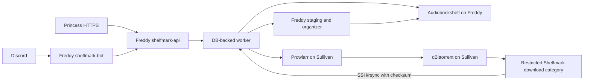

# Shelfmark upgrade plan

This document captures the review of the current Shelfmark repository and the proposed path to a Dockerized service on Freddy, integrated with Audiobookshelf, Prowlarr, qBittorrent, Sullivan, Discord, and an optional web UI.

The recommended deployment is:

- Shelfmark runs on Freddy beside Audiobookshelf.
- Freddy owns the canonical audiobook and ebook storage, job state, organizer, API, worker, and Discord bot.
- Sullivan remains the search and download host: Prowlarr → qBittorrent → a restricted Shelfmark download category.
- Freddy pulls completed downloads from Sullivan over restricted SSH/rsync, verifies them, organizes them, and triggers an Audiobookshelf scan.
- Discord handles requests and job control.
- A thin web UI handles metadata review, dense release selection, and large downloads.

At review time, no implementation changes had been made. The existing
self-test passed with Python 3.14.4. Docker Compose was not executed because
Docker is not installed in the review environment.

## Current progress

**Deployed 2026-09-12.** Shelfmark runs on Freddy beside Audiobookshelf:
`shelfmark-api` and `shelfmark-worker` from `ghcr.io/nuniesmith/shelfmark:latest`,
published at `shelfmark.7gram.xyz` through Princess. The Discord bot sits behind a
`discord` Compose profile until a token exists. P0 is largely closed — see
[`docs/INVENTORY.md`](INVENTORY.md) for the configuration record and findings.

The first implementation slices are complete: organizer safety fixes, regression
coverage, Python packaging metadata, a reproducible CLI container, the initial
API/SQLite worker foundation, and isolated transport clients for the three
existing media APIs have been added. No live Freddy or Sullivan deployment has
been changed yet.

Validation run locally with Python 3.14.4:

```text
python3 -m unittest discover -s tests -v   # 10 tests passed
python3 src/main.py --self-test             # self-test OK
```

The remaining service work still needs the API, persistent jobs, integration
clients, Discord adapter, and staged deployment checks described below.

## Current repository

The current project is a command-line organizer and Audiobookshelf metadata repair utility.

Implemented capabilities include:

- Audiobook and ebook detection.
- Archive extraction.
- Author, title, year, and narrator parsing.
- Audio tag enrichment through Mutagen.
- Cover and sidecar handling.
- Dry-run previews.
- Move or copy workflows.
- Audiobookshelf metadata repair.

Relevant files:

- `src/main.py` — organizer, parser, archive handling, plan generation, and CLI.
- `src/fix_metadata.py` — one-off Audiobookshelf metadata repair utility.
- `run.sh` — local virtualenv bootstrap and CLI entrypoint.
- `requirements.txt` — currently only `rarfile` and `mutagen`.
- `README.md` — current CLI behavior and expected library layout.

There is currently no Dockerfile, HTTP API, persistent job database, background worker, Discord bot, Prowlarr integration, qBittorrent integration, Sullivan-to-Freddy transfer mechanism, web UI, or CI test suite.

## Pre-automation defects to fix

These should be fixed before allowing an unattended service to move or delete files.

- [ ] Fix book identity in `src/main.py`. The current merge key contains only author, title, and year. Include media type, narrator, series, series position, edition, language, format, and checksum where available.
- [ ] Keep audiobooks and ebooks in separate plans even when their normalized author/title/year values match.
- [ ] Prevent different narrators and editions from merging into one book.
- [ ] Preserve `metadata.json`, OPF files, manifests, embedded metadata, and recognized sidecars when scanning an already-managed library.
- [ ] Make unknown-file trashing explicit and disabled by default for managed libraries.
- [ ] Include parent-directory context in multipart archive identity so unrelated folders cannot be conflated.
- [x] Extract archives into an isolated staging directory before importing their contents. Staged beside the destination so the finished tree moves into place with an atomic `rename` — a staging root on another filesystem would make that a copy, with an observable half-done state.
- [x] Leave failed archives in place and mark the job failed; never move a failed archive to trash and return success. The archive is trashed only after a successful extract.
- [x] Make move/copy operations resumable and idempotent. If the destination already contains the same file, compare size/checksum and skip it instead of creating `01 (2).mp3`. The remaining hole was an INTERRUPTED write: a truncated file under the real name is not identical to the source, so the retry wrote `01 (2).mp3` beside it. Writes now stage and rename, so the destination is complete or absent.
- [x] Add an append-only transaction manifest for every worker import: source, destination, operation, checksum, timestamp, actor, and result.
- [x] Write destination files atomically, then rename the completed destination directory into place. **Files are atomic** — staged in the destination directory, fsynced, renamed into place; `move` uses `os.rename` directly within a filesystem and stages only across the EXDEV boundary. **Whole-directory staging is done for new books**: a book whose destination folder does not exist yet is assembled in `.shelfmark-work-books` beside it (a separate marker from archive extraction's `.shelfmark-work`, so the two can never contend over one working directory) and handed over with a single `rename`, so the library never shows one missing tracks. A same-filesystem track is staged with `os.rename` too, not a copy — reorganising a library in place stays metadata-only work, not a full read-and-rewrite — with each renamed pair recorded so a failure partway can reverse them; a rename-back that itself fails leaves the staging directory in place (printed for recovery) rather than deleting the only remaining copy. Filing into a book already on disk (a repeat run, or new files for one already imported) still writes file by file — that folder is already visible to a scan either way, and `rename` cannot merge into a non-empty destination regardless. **Caveat:** the rollback above only runs for catchable failures. `SIGKILL`/OOM/power-cut skip it entirely, stranding renamed tracks in `.shelfmark-work-books` — invisible to a scan and no longer in the source, which is a regression against the old file-by-file behaviour's self-healing re-run. Every run now checks the destination tree for one of these before scanning and reports it loudly on stderr; it is never deleted or auto-completed, so recovery is manual. Full resume/auto-recovery is a separate, still-open item.
- [ ] Use a quarantine directory for failed or ambiguous jobs instead of deleting source material. **Done for extraction failures** (`--quarantine`, default `<source>/.shelfmark-quarantine`); still open for the other job types.
- [x] Review all archive extractors for path traversal and symlink behavior. External extractors should run in staging with post-extraction validation. `_safe_target` screens member names; `_reject_escaping_links` runs after extraction, which is the only point unrar/unar/7z can be held to the same rule.
- [ ] Keep the CLI dry-run/apply behavior compatible with the existing README.
- [ ] Treat `fix_metadata.py` as a migration utility, not as the live metadata path. Revisit its assumption that metadata always exists at exactly two directory levels.
- [ ] Align the Python version requirement. Use Python 3.13 or newer in Docker and update the README and `run.sh` check accordingly.

## Compose and storage findings

### Freddy

The checked-in Freddy compose already provides the audiobook root:

- Host `/mnt/1tb/audiobooks` is mounted as `/audiobooks` for Audiobookshelf in `freddy.docker-compose.yml`.
- Audiobookshelf publishes host port `13378` to container port `80`.
- Freddy has no Shelfmark service yet.
- Nextcloud already uses host port `8080`, so Shelfmark should use a different port such as `8110`.
- Freddy and Sullivan are separate Docker hosts; container names from Sullivan will not resolve from Freddy.

Suggested Freddy paths:

```text
/mnt/1tb/audiobooks              existing audiobook root
/mnt/1tb/ebooks                  canonical ebook root
/mnt/1tb/shelfmark/incoming      transferred downloads
/mnt/1tb/shelfmark/work          extraction and temporary work
/mnt/1tb/shelfmark/quarantine    failed or awaiting-review jobs
/mnt/1tb/shelfmark/data          database and application state
/mnt/1tb/shelfmark/backups       manifests and database backups
```

### Sullivan

The Sullivan compose contains the services needed for the download side:

- qBittorrent is on the `download` network and publishes port `8080`.
- Prowlarr is on the `download` network and publishes port `9696`.
- qBittorrent exposes `/complete`, `/audiobooks`, and `/ebooks` using Sullivan host paths.
- Unpackerr watches the whole `/complete` tree.
- There is no Readarr or audiobook-specific *arr service in the checked-in compose.
- Calibre and Calibre-Web currently use Sullivan book storage rather than Freddy storage.

Important path issue:

- qBittorrent defaults to `/media/qbittorrent/complete`.
- Sonarr, Radarr, Lidarr, Filebot, and Unpackerr default to `/mnt/media/qbittorrent/complete`.

The real `.env` may override these values, so resolve both deployments with `docker compose config` and normalize them before integration.

Unpackerr and Shelfmark must not process the same directory concurrently. The recommended choice is to reserve `/complete/shelfmark-books` for Shelfmark and let Shelfmark's existing Python organizer own extraction for that category. Exclude it from Unpackerr's general folder watcher.

Calibre-Web's current application-data mapping is `/data`, while LinuxServer's documentation specifies `/config`. Correct this before relying on Calibre-Web. Also decide which system owns the ebook database; do not let Calibre-Web and Shelfmark write the same Calibre database concurrently.

The Sullivan compose contains a literal Plex claim credential. Rotate it and remove it from the compose and Git history. Store all API keys, passwords, bot tokens, OIDC secrets, and SSH keys outside Git.

## Target architecture



Run three processes from one Shelfmark image:

- `shelfmark-api` — FastAPI REST API, health endpoints, and web UI backend.
- `shelfmark-worker` — one persistent worker for transfers, extraction, organization, metadata, and scans.
- `shelfmark-bot` — Discord Gateway client.

For the first release, SQLite in WAL mode is sufficient with one worker. Store it under `/mnt/1tb/shelfmark/data`. Keep the data layer abstract so PostgreSQL can be added later if multiple workers or higher concurrency become necessary.

The worker must never accept arbitrary filesystem paths from Discord or the web UI. It should only resolve known library roots and job-managed staging directories.

## Data model and job state

Add durable records for:

- `library_items` — normalized author, title, year, series, narrator, format, path, checksum, size, Audiobookshelf ID, and ebook authority ID.
- `search_results` — normalized Prowlarr result, release GUID, indexer, format, size, seeders, score, and expiry time.
- `download_jobs` — request UUID, actor, guild/channel/message IDs, release ID, Prowlarr ID, qBittorrent hash, and status.
- `transfer_jobs` — Sullivan source path, Freddy staging path, checksum manifest, and verification result.
- `organize_jobs` — organizer version, plan JSON, warnings, source path, destination path, and approval state.
- `metadata_jobs` — provider, candidate metadata, before/after values, and approval state.
- `audit_events` — actor, action, target, timestamp, result, and redacted error details.

Use a state machine similar to:

```text
requested
→ searched
→ selected
→ grabbed
→ downloading
→ complete
→ transferring
→ extracting
→ organizing_preview
→ awaiting_approval
→ organizing
→ scanning
→ done
```

Terminal states should include `failed` and `cancelled`. Every state transition must be persisted before sending a notification. Jobs need retry counts, exponential backoff, lease expiry, and recovery after worker restart.

## External API boundaries

### Audiobookshelf

Use the Audiobookshelf API as the audiobook metadata authority. Use a Bearer API token and never access the ABS database directly.

Implement adapters for:

- List libraries and items.
- Search an existing library.
- Search metadata providers.
- Match a library item.
- Patch item metadata.
- Upload or update covers.
- Scan an item or library.
- Retrieve stable links for users.

Metadata actions should show a before/after diff and require confirmation when confidence is not high.

Reference: <https://api.audiobookshelf.org/> and <https://github.com/audiobookshelf/audiobookshelf-docs/blob/master/docs/documentation/libraries/book-library/2.book-metadata.md>

### Prowlarr

Use Prowlarr for new-release search and grabbing:

- `GET /api/v1/search` for results.
- `POST /api/v1/search` for the selected release.

Prefer the Prowlarr grab path so its configured download client and indexer handling remain authoritative. Store the release GUID and Prowlarr response for recovery and duplicate detection.

Reference: <https://github.com/devopsarr/prowlarr-py/blob/main/docs/SearchApi.md>

### qBittorrent

Use qBittorrent for progress and lifecycle management:

- Login/session handling.
- Torrent info and state polling.
- Pause, resume, and cancel.
- Hash, content path, size, and completion verification.

Reference: <https://github.com/qbittorrent/qBittorrent/wiki/Web-API-Documentation/87ec6b289ea5376b648e8cbb1373fb538da9f01d>

### Sullivan-to-Freddy transfer

- [x] Create a restricted Sullivan account such as `shelfmark-sync`.
- [x] Limit its SSH/rsync access to the Shelfmark qBittorrent category, via a forced `rrsync -ro` command in `authorized_keys`. Verify with `docker exec shelfmark-worker verify-sullivan-sync` — never by hand, since three of its four checks pass by failing.
- [x] Use a dedicated SSH key stored as a Docker secret on Freddy.
- [~] Pull completed files from Freddy after qBittorrent reports completion. **The pull works and is verified end to end; nothing watches qBittorrent for completion yet** — the job has to be started by hand. This is the orchestration gap, and it is what P3 still needs.
- [x] Verify size and checksum before organization. A mismatch fails the job rather than handing a partial tree to the organiser, which is destructive.
- [x] Leave the Sullivan source available for seeding and recovery until the Freddy import is verified. True by construction: the sync account is `rrsync -ro`, so Shelfmark cannot delete anything on sullivan even if asked to.
- [ ] Only remove remote data through an explicit retention policy after successful import. Nothing removes remote data today, and the read-only account means nothing can.

## Download workflow

1. User invokes `/search-new`.
2. Shelfmark searches Prowlarr.
3. The bot displays title, author, format, size, indexer, seeders, and quality.
4. User selects a result and confirms.
5. Shelfmark submits the selected release through Prowlarr.
6. The worker records the Prowlarr release ID and qBittorrent hash.
7. The worker polls qBittorrent until files are complete and stable.
8. Freddy pulls only the Shelfmark category over restricted SSH/rsync.
9. The worker verifies the transfer and extracts into isolated staging.
10. The organizer generates a preview manifest.
11. High-confidence plans can be automatically applied; ambiguous plans require approval.
12. Files are atomically moved into the Freddy audiobook or ebook root.
13. Shelfmark triggers an Audiobookshelf scan.
14. The bot posts the final status and a stable link.

## Discord bot

Discord is suitable for search, selection, download requests, status, cancellation, organization approval, metadata approval, scans, and links.

Recommended commands:

```text
/have query [type]
/search-new query [type]
/grab release_id
/downloads
/download job_id
/cancel job_id
/organize job_id
/metadata item_id
/scan [library]
/get item_id
```

Implement:

- [ ] Discord application and bot registration.
- [ ] Guild-scoped slash commands during development.
- [~] Buttons, select menus, and modals for release and metadata selection. Buttons only (no select menus/modals yet), but now cover ebooks too: `/ebook-search` sends the on-server file straight to the requester's phone as an ephemeral attachment (path-traversal-safe opaque id, size checked against Discord's limit before any upload is attempted), and `/ebook-request` reuses the existing grab-button/job path against Prowlarr restricted to `PROWLARR_BOOK_CATEGORIES` (default 7000 — the one indexer here doesn't advertise 7020/EBook).
- [x] Role/user allowlists for download, organize, metadata, and scan actions. **Fails closed** — an unset `SHELFMARK_DISCORD_ALLOWED_ROLE_IDS` refuses everyone rather than permitting everyone, which is what it did before. Applies to `/ebook-search` and `/ebook-request` the same as every other command.
- [ ] Per-user and per-guild rate limits.
- [ ] Audit records containing Discord user, guild, channel, and message IDs.
- [ ] Immediate interaction deferral, followed by persistent job notifications.
- [ ] Recovery notifications after bot or worker restarts.
- [ ] No privileged message-content intent unless later required.

Discord interactions should be acknowledged immediately and processed asynchronously. Interaction tokens are time-limited, so long-running jobs must use normal bot messages after the interaction window expires. The effective attachment limit is provided in the interaction payload and can vary, so large audiobooks should be delivered as Audiobookshelf or signed Shelfmark links rather than Discord attachments.

References:

- <https://docs.discord.com/developers/events/gateway>
- <https://docs.discord.com/developers/interactions/receiving-and-responding>
- <https://docs.discord.com/developers/reference>

## Web UI and Princess

A web UI is recommended as a thin companion to Discord, not as a separate business-logic implementation.

Build these views first:

- Library search and filters.
- New-release search and sortable result table.
- Release detail and confirmation.
- Active and completed jobs.
- Organization preview and approval.
- Metadata candidate comparison and approval.
- Audit log and administrative settings.

The UI should use the same REST API as the Discord bot. Use the *arr interface as a design reference, but perform a license review before copying source code or components.

For downloads:

- Use Audiobookshelf links for audiobooks.
- Use short-lived signed Shelfmark URLs for ebooks.
- Support HTTP range requests for large files.
- Resolve downloads by database item ID, never by a user-supplied filesystem path.

Princess deployment tasks:

- [ ] Create the `shelfmark.7gram.xyz` virtual host.
- [ ] Route it to Freddy over WireGuard, Tailscale, or another private tunnel.
- [ ] Configure TLS and secure headers.
- [ ] Configure Authentik OIDC or forward authentication if web access is shared.
- [ ] Configure long enough proxy timeouts for searches and job views.
- [ ] Configure WebSocket/SSE forwarding only if live updates use it.
- [ ] Keep qBittorrent, Prowlarr, and the Shelfmark API off the public internet.

## Detailed implementation backlog

### P0 — inventory and safety

- [x] Resolve Freddy and Sullivan compose files with their real environment files.
- [x] Record private addresses, VPN routes, and SSH reachability, including firewall rules — see INVENTORY finding 8: ufw does not filter Docker-published ports.
- [x] Confirm canonical audiobook and ebook roots on Freddy.
- [x] Decide whether ABS or Calibre-Web owns ebooks. **ABS** — Calibre-Web has never run and both ebook roots are empty, so there is nothing to migrate and no competing writer.
- [x] Back up ABS config, ABS metadata, current audiobook storage, Sullivan book storage, compose files, and environment files. 79G on sullivan, verified by file count and a zero-difference `rsync --itemize-changes` pass.
- [x] ~~Rotate the committed Plex claim~~ — a claim token is valid five minutes after generation, so a stale one in Git is inert.
- [x] Create the restricted Sullivan sync account and key. Account and key are in place; it was dead on arrival until the login shell was corrected — see INVENTORY finding 7.

Acceptance criteria:

- A sanitized configuration document records every host path, container path, API URL, port, and credential source.
- Freddy can reach only the required Sullivan APIs and SSH path over the private network.
- Backups can be restored to a temporary directory.

### P1 — organizer hardening

- [ ] Extract parser, metadata, archive, planning, and file-operation code into importable modules.
- [ ] Add the expanded identity model.
- [x] Preserve managed-library sidecars.
- [x] Add isolated extraction and archive safety checks.
- [x] Add manifests and operation checksums. **Atomic file writes, extraction quarantine, and whole-directory staging for new books are done**; resume logic for a book already partly on disk remains file-by-file.
- [x] Make repeated imports idempotent for identical move/copy retries.
- [~] Add structured JSON output and stable error codes. **Stable error codes are done**: `shelfmark_service/errors.py` defines an append-only `ErrorCode` enum (`provider_not_configured`, `invalid_payload`, `source_missing`, `extraction_failed`, `verification_failed`, `upstream_unavailable`, `cancelled`, `internal`) and a `ShelfmarkError` exception; `worker.execute()` raises it from every real failure site (mapped from the actual `clients.py`/`transfer.py`/`main.py` failure modes, not invented), anything unmapped becomes `internal`, and the code is persisted alongside the free-text message (`jobs.error_code`, migration 2) and exposed as `code` on `GET /api/v1/jobs/{id}` and in the Discord `/job` reply. **Structured JSON output for the CLI is still open** — `main.py`'s `--dry-run`/`--apply` output is still plain text, untouched by this change.
- [x] Add regression fixtures for mixed media, multipart isolation, broken archives, unknown files, and repeated copy runs.
- [x] Keep CLI compatibility.

Acceptance criteria:

- A failed extraction leaves its source archive untouched and returns a failed result.
- Running the same import twice produces no duplicate files.
- An existing Audiobookshelf library keeps its metadata sidecars.
- Audio and ebook editions never merge accidentally.

### P2 — service foundation

- [x] Add `pyproject.toml` and pinned dependencies.
- [x] Add a Python 3.13 Dockerfile and `.dockerignore`.
- [x] Add FastAPI and Uvicorn.
- [x] Add SQLite schema, migrations, and WAL mode.
- [x] Add the database-backed worker queue.
- [x] Add health/readiness endpoints and worker heartbeat.
- [x] Requeue jobs abandoned by a stale worker heartbeat.
- [ ] Add structured logs, correlation IDs, and redaction.
- [ ] Add API authentication and role checks.
- [x] Add the audit log.

Suggested API surface:

```text
GET  /api/v1/library/search?q=&type=
GET  /api/v1/items/{item_id}
GET  /api/v1/releases/search?q=&type=
POST /api/v1/releases/{release_id}/grab
GET  /api/v1/jobs
GET  /api/v1/jobs/{job_id}
POST /api/v1/jobs/{job_id}/cancel
POST /api/v1/organize/preview
POST /api/v1/organize/{job_id}/apply
GET  /api/v1/items/{item_id}/metadata-candidates
POST /api/v1/items/{item_id}/metadata
POST /api/v1/library/scan
GET  /api/v1/downloads/{item_id}
GET  /healthz
GET  /readyz
```

### P3 — integration clients

- [x] Implement Audiobookshelf client transport wrapper.
- [x] Implement Prowlarr search and grab client transport wrapper.
- [x] Implement qBittorrent status and lifecycle client transport wrapper.
- [x] Expose authenticated library/release search and asynchronous release-grab API routes.
- [x] Add restricted rsync pull and local stable-file detection for Sullivan transfers.
- [x] Add initial Discord slash-command adapter with deferred responses and release-grab buttons.
- [x] Add Discord metadata-match and library-scan job commands.
- [x] Add qBittorrent Shelfmark-category status to the API and Discord adapter.
- [x] Implement SSH/rsync transfer client. `RsyncTransfer` in `transfer.py`, driven by `POST /api/v1/transfers/pull`.
- [x] Implement stable-file detection. `wait_until_stable` — two identical snapshots AND a minimum age, so a file written twice inside one filesystem timestamp tick is not called settled.
- [x] Implement checksum verification. A second `rsync --checksum --dry-run` pass after the tree settles. **The differences are in the OUTPUT, not the exit status** — rsync exits 0 either way, so reading the status would report every transfer as verified, corrupt ones included.
- [x] Implement organizer preview/apply jobs. `organize_preview` and `organize_apply` in `worker.execute`.
- [x] Implement ABS scan and metadata jobs. `library_scan`, `metadata_match`, `metadata_update`.
- [x] Add client timeouts, retries, backoff, and circuit breaking. Timeouts, bounded retries and backoff are in `HttpClient`. Circuit breaking is a three-state breaker (`CircuitBreaker` in `clients.py`) keyed by service name in a process-wide registry — HttpClient instances are built fresh per job, so a breaker living on the instance would reset every job and never trip; the registry is what lets job N+1's brand-new client see job N's failures. Only connection errors, timeouts, and 5xx count against it — a 401/404 is a bad request or credential, not the provider being down, so it does not trip the breaker for every other job behind it in the queue. Configurable via `SHELFMARK_CIRCUIT_BREAKER_FAILURE_THRESHOLD` / `SHELFMARK_CIRCUIT_BREAKER_COOLDOWN_SECONDS`.

Acceptance criteria:

- Each external API can be mocked in tests.
- API failures produce retryable or terminal states explicitly.
- No secret values appear in logs.

### P4 — Freddy deployment

- [ ] Create the Freddy Shelfmark directories.
- [ ] Add `shelfmark-api`, `shelfmark-worker`, and `shelfmark-bot` to Freddy compose.
- [ ] Mount only required audiobook, ebook, staging, quarantine, and data paths.
- [ ] Run containers with the matching non-root UID/GID.
- [ ] Use a private host port such as `8110`.
- [ ] Add health checks, restart policies, resource limits, and log rotation.
- [ ] Store secrets through Docker secrets or an external environment file.
- [ ] Add Uptime Kuma checks for API, worker heartbeat, ABS, Prowlarr, and qBittorrent reachability.

Acceptance criteria:

- `docker compose config` succeeds on Freddy.
- All three Shelfmark processes restart cleanly.
- A staged folder can be organized without touching Sullivan.

### P5 — Sullivan deployment

- [ ] Normalize `DOWNLOAD_PATH_COMPLETE` across qBittorrent, Unpackerr, Filebot, and all *arr services.
- [ ] Create qBittorrent category `shelfmark-books` with a dedicated save path.
- [ ] Configure Prowlarr's qBittorrent download client.
- [ ] Restrict Prowlarr and qBittorrent host ports to the private network or Freddy's address.
- [ ] Exclude the Shelfmark category from Unpackerr, or configure an entirely separate watcher.
- [ ] Verify qBittorrent, organizer, and SSH user permissions.
- [ ] Correct Calibre-Web's application-data mount to `/config` if it remains in use.
- [ ] Run a controlled end-to-end transfer using content that is authorized for download.

Acceptance criteria:

- Freddy can search Prowlarr and receive results.
- A selected release is grabbed by Prowlarr into the Shelfmark qBittorrent category.
- The worker can detect completion and transfer the files to Freddy.
- Unpackerr does not race with Shelfmark.

### P6 — Audiobookshelf and ebook migration

- [ ] Discover ABS library IDs and create a least-privilege API key.
- [ ] Index existing ABS items into Shelfmark's database.
- [ ] Add duplicate detection using ABS IDs, normalized metadata, paths, sizes, and checksums.
- [ ] Implement metadata candidate review and ABS API updates.
- [ ] Create or migrate the Freddy ebook library.
- [ ] If continuing with Calibre-Web, migrate its library once and keep one writable authority.
- [ ] Keep the Sullivan copy read-only until verification is complete.
- [ ] Trigger scans only after successful verified imports.

Acceptance criteria:

- `/have` returns existing audiobook and ebook results.
- Metadata changes are visible in Audiobookshelf after approval.
- A migrated ebook can be found and downloaded from the chosen ebook authority.

### P7 — Discord bot

- [ ] Create and configure the Discord application.
- [ ] Register guild-scoped slash commands.
- [x] Implement initial slash commands with immediate defer and persistent job IDs.
- [ ] Implement library search embeds.
- [ ] Implement Prowlarr result pagination and selection.
- [ ] Implement confirmation buttons.
- [ ] Implement download progress notifications.
- [ ] Implement cancellation.
- [ ] Implement organization preview and approval.
- [ ] Implement metadata candidate comparison and approval.
- [ ] Implement scan and stable-link commands.
- [ ] Add role/user permissions and rate limits.
- [ ] Test bot behavior after worker restarts and after the interaction token expires.

Acceptance criteria:

- A Discord user can search existing books without web access.
- A user can select and confirm one release.
- A completed job posts a stable Audiobookshelf or Shelfmark link.
- Unauthorized users cannot grab, organize, modify metadata, or scan.

### P8 — web UI and Princess

- [ ] Build a thin UI on the same API.
- [ ] Add library search, release search, job status, metadata review, and audit views.
- [ ] Add Authentik OIDC if the UI will be shared.
- [ ] Add short-lived signed download URLs with range support.
- [ ] Configure `shelfmark.7gram.xyz` on Princess.
- [ ] Route Princess to Freddy over a private tunnel.
- [ ] Configure TLS, CSP, secure cookies, proxy timeouts, and access logs.
- [ ] Perform a license review before copying any *arr source code.

Acceptance criteria:

- The UI is reachable at `https://shelfmark.7gram.xyz` through the private route.
- A user can search, approve a release, inspect a job, and approve metadata in the browser.
- Large ebook downloads stream without loading the entire file into memory.

### P9 — release and operations

- [ ] Run unit and integration tests.
- [ ] Run a staged search → grab → download → transfer → organize → scan workflow.
- [ ] Kill and restart the worker during a transfer and verify resume behavior.
- [ ] Test Prowlarr, qBittorrent, ABS, SSH, and metadata-provider outages.
- [ ] Test path traversal, arbitrary path submission, expired links, and unauthorized Discord users.
- [ ] Run a backup and restore drill.
- [ ] Pin production image versions instead of relying only on `latest`.
- [ ] Document rollback using the quarantine directory and transaction manifest.
- [ ] Document upgrade and migration procedures.

## Recommended rollout order

1. Complete P0 inventory, backups, credential rotation, and network access.
2. Complete P1 organizer hardening and regression tests.
3. Deploy the Freddy API and worker with manual staged-folder imports.
4. Normalize Sullivan paths and validate restricted transfer.
5. Add Prowlarr and qBittorrent search/grab integration.
6. Add Audiobookshelf metadata and scan integration.
7. Add the Discord bot.
8. Add the web UI and Princess route.
9. Migrate existing ebook storage and complete the operational restore drill.

This order makes the organizer and recovery behavior safe before downloads become automated.

## Reference documentation

- Audiobookshelf API: <https://api.audiobookshelf.org/>
- Audiobookshelf metadata: <https://github.com/audiobookshelf/audiobookshelf-docs/blob/master/docs/documentation/libraries/book-library/2.book-metadata.md>
- Discord Gateway: <https://docs.discord.com/developers/events/gateway>
- Discord interactions: <https://docs.discord.com/developers/interactions/receiving-and-responding>
- Discord API limits and attachments: <https://docs.discord.com/developers/reference>
- Prowlarr search API model: <https://github.com/devopsarr/prowlarr-py/blob/main/docs/SearchApi.md>
- qBittorrent Web API: <https://github.com/qbittorrent/qBittorrent/wiki/Web-API-Documentation/87ec6b289ea5376b648e8cbb1373fb538da9f01d>
- Unpackerr configuration: <https://github.com/Unpackerr/unpackerr/blob/main/examples/unpackerr.conf.example>
- LinuxServer Calibre-Web: <https://docs.linuxserver.io/images/docker-calibre-web/>
